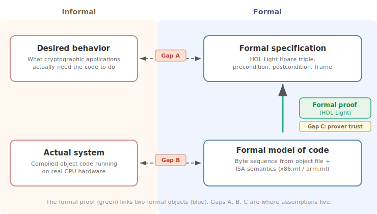

# Soundness of s2n-bignum Formal Verification

s2n-bignum provides machine-checked proofs that its machine code routines produce
mathematically correct results for all inputs. But no formal verification is
absolute. Every FV effort links two **formal** objects -- a specification and a
model -- each of which is *assumed* to correspond to something informal and
real. This document maps out those assumptions and the risks that arise when
they fail.

The diagram below shows the structure. The green arrow is what the proof
establishes. The orange gaps are where assumptions live.

**What the proof says, precisely:** For each function, HOL Light proves a Hoare
triple of the form

> *If* the machine state satisfies a precondition (code loaded, registers and
> memory set up per the ABI, mathematical inputs in the right buffers),
> *then* execution on the formal ISA model is guaranteed eventually to reach a state satisfying a
> postcondition (return address in PC, output buffers contain the correct
> mathematical result), *and* only the listed state components may have values in the final state
> different from the values in the initial state (the frame condition).

The byte sequence proved is checked against the actual object file
produced by the build, so compiler/assembler correctness is not a direct
assumption.

---

## Summary of risks

Mitigations in *italics* are planned future work or actions available to
motivated users.

| # | Risk | Primary mitigation |
|---|------|--------------------|
| A1 | Wrong functional spec | Specifications written in simple mathematical style; integration and conformance tests (NIST CAVP, Wycheproof) |
| A2 | Precondition mismatch | Preconditions explicit in formal statements; signature cross-checking; *planned C-level contracts* |
| A3 | Non-constant-time code | Formal constant-time proofs for all functions currently used by AWS-LC; empirical timing tests |
| A4 | Out-of-bounds memory access | Formal memory-safety proofs for all functions currently used by AWS-LC; frame conditions; Valgrind |
| B1 | Wrong ISA model or decoder | Co-simulation testing against real hardware on every CI run |
| B2 | Buggy ELF loader | Loader errors typically cause proof failure; function-level random testing |
| B3 | Model omissions (caches, speculative execution, etc.) | Standard for sequential user-mode verification; omissions documented |
| C1 | HOL Light kernel or OCaml runtime bug | 20+ year track record; OCaml maturity; *independent proof checking (Candle, HOLTrace)* |
| D1 | Environment assumptions violated | Assumptions documented; standard for target platforms |
| D2 | C header/assembly mismatch | Signature cross-checking tool; function-level testing; *planned formal link* |
| D3 | Caller violates preconditions | Manual review at call sites; *planned C-level contracts* |

Details for each risk follow in the sections below.

---

## Gap A: Does the formal specification match actual requirements?

This is the gap between what we *prove* and what users and applications
actually *need*. It has several facets.

### A1. Functional specification correctness

The mathematical formulas (e.g., `(m * n) MOD p_25519`) could
themselves be wrong: a typo in a curve constant, a subtle error in the
definition of X25519 point operations, etc.

**Mitigations.** Specifications are deliberately written in a high-level
mathematical style that is far simpler than the implementations, making
shared-mode failures unlikely. Strong internal consistency checks exist: for
example, it would be very hard to get an elliptic-curve constant wrong while
still finding the correct group order. Integration into AWS-LC and execution
against standard conformance test suites (NIST CAVP, Wycheproof) provides
further end-to-end validation. This simplicity argument applies most strongly
to the purely arithmetic functions that still form the bulk of s2n-bignum; more
recent additions such as SHA-3 hash functions have more complex, program-like
specifications where a specification bug is harder to rule out,
making the conformance-test validation particularly important for those
functions.

### A2. Preconditions and user expectations

Specifications carry non-trivial preconditions that may surprise callers:

- Aliasing restrictions: some functions forbid overlapping input/output
  buffers; others require them to be either identical or fully disjoint.
- Some modular operations assume inputs are already reduced.
- Some point operations exclude points at infinity or other degenerate cases.

All assumptions are explicit in the formal statements but may not be obvious
from the C header alone. There is currently no complete machine-checked link between
the C declarations in `s2n-bignum.h` and the formal specifications
(but see [D2](#d2-c-headerassembly-interface) below).

### A3. Constant-time execution

s2n-bignum functions are written using a strict constant-time discipline:
the instruction sequence and memory-access pattern depend only on nominal
sizes, never on secret data values (with the single explicit exception,
telegraphed in the function name, of `mlkem_rej_uniform_VARIABLE_TIME`).

**Formal proofs.** Since late 2025, s2n-bignum has included formal HOL Light
proofs of the constant-time property alongside functional correctness. The
formal model introduces *microarchitectural events* that flag uses of
instructions with potentially data-dependent timing (e.g., integer division).
The safety proof then establishes that (a) the sequence of instructions
executed and all memory addresses accessed are independent of secret inputs,
and (b) no variable-timing microarchitectural events occur. All s2n-bignum functions currently used by AWS-LC -- covering
P-256, P-384, P-521, X25519, Ed25519, Montgomery operations, Karatsuba
multiplications, and ML-KEM routines on both ARM and x86 -- now have formal
constant-time proofs. The plan is to extend this to all functions in the
library.

**Empirical testing.** In addition to the formal proofs, a benchmarking tool
generates random inputs of varying bit density and measures runtime variance
and correlation, providing a complementary empirical check.

**Residual risks:**
- Functions not yet covered by the formal proof rely solely on the coding
  discipline and empirical testing.
- The formal proof establishes that the *instruction sequence and memory
  access pattern* are secret-independent. It does not and cannot guarantee
  that the hardware executes those instructions in constant time.
  Microarchitectural effects (variable-latency instructions, Hertzbleed-style
  frequency scaling) could still leak information. Some hardware provides
  opt-in guarantees for a listed set of instructions: ARM platforms with the
  DIT (Data Independent Timing) bit set (Armv8.4-A onwards), and Intel
  platforms with DOITM (Data Operand Independent Timing Mode) enabled (Ice
  Lake onwards; earlier Intel processors are documented as behaving as if
  DOITM is always enabled). AMD does not currently offer an equivalent
  mechanism. Even with DIT or DOITM enabled, coverage is limited to a
  specific set of instructions, and power/frequency-based side channels
  remain outside scope.

### A4. Memory safety

The functional-correctness specifications alone do not fully guarantee memory
safety. The underlying memory model is a flat byte-addressed array with no
notion of "valid" or "allocated" addresses; reads and writes always succeed.
The frame condition constrains only what is *written* (and only by comparing
initial and final states), so in principle:

- **Out-of-bounds reads** are not excluded by a functional correctness proof.
- **Transient writes** (writing then restoring a value) are not excluded
  either.

**Formal proofs.** The same safety proof infrastructure introduced for
constant-time (see A3) also proves memory safety: it establishes that all
memory reads and writes performed by a function fall within the bounds
declared in its specification. All functions currently used by AWS-LC now have
formal memory-safety proofs on both ARM and x86, and coverage is being
extended to the full library.

**Residual risks.**

- Functions not yet covered by the safety proof rely on the simplicity of
  their memory-access patterns and the partial protection of the frame
  condition. In addition, `mlkem_rej_uniform_VARIABLE_TIME` currently lacks a
  memory-safety proof because the safety and constant-time properties are
  proved together and this function is by design not constant-time. This is
  not an essential limitation of the proof infrastructure, and adding a
  standalone memory-safety proof for this function is planned.
- **Stack discipline.** For thread safety, code must not read or write below
  the stack pointer (beyond the red zone on platforms that define one). The
  formal model does track the stack pointer register, so this property could
  in principle be enforced -- for example by failing memory accesses at a
  negative offset from SP, analogous to the existing ARM model's rejection of
  unaligned SP accesses -- but defining "negative offset" rigorously in
  modular 64-bit arithmetic is somewhat ad hoc. The current memory-safety
  proofs do not check this property. We rely on engineering discipline,
  validated empirically with Valgrind.

---

## Gap B: Does the formal model match the actual system?

This is the gap between the formal representation of the code and machine, and
the real object code running on real hardware.

One important aspect of the s2n-bignum approach significantly narrows this gap:
**proofs are about the actual object-code byte sequences**, which are checked
against the object files produced by the build. This eliminates any direct
dependence on the correctness of compilers or assemblers -- a class of
assumption that affects many other formal verification efforts.

**Caveat: reassembly in downstream projects.** When s2n-bignum `.S` files are
imported into another project and assembled on a different system, there is
currently no systematic check (e.g., hash comparison or watermarking) that the
resulting object code matches the bytes the proofs were verified against. An
assembler bug or version difference could in principle produce different code.
Running the s2n-bignum proofs on the target platform would catch this, but
may be considered too time-consuming to be part of routine builds.

### B1. ISA model fidelity

The ISA models define both decoding from byte sequences (`decode.ml`) and
core instruction semantics (`arm.ml`/`x86.ml`); these are hand-written from
the Intel/AMD and ARM Architecture Reference Manuals. Errors in those
references, misunderstandings, or transcription mistakes could silently
invalidate proofs.

**Mitigation: co-simulation testing.** A continuous-integration test
(`simulator.ml` + `simulator.c`) repeatedly picks random instruction
encodings and random register/flag states, decodes them, executes them both
symbolically through the formal model and natively on real hardware, and
compares results. This exercises both the ISA semantics and the decoder on
every test. It runs for 30 minutes on 8 cores per CI run and covers:

- All register-to-register instruction forms with randomized operands.
- Memory-accessing instructions via dedicated harnesses for various
  addressing modes (base+displacement, base+index*scale+displacement,
  aligned and unaligned variants).

This provides high confidence, but is inherently incomplete: it cannot cover
every possible operand combination or interact with every microarchitectural
quirk. Where instructions have genuinely underspecified behavior -- for
example, the `IMUL` instruction sets flags differently on different x86
microarchitectures -- the s2n-bignum model reflects this nondeterminism, and
proofs are valid regardless of which behavior the hardware exhibits.

### B2. ELF object-code loader

An OCaml ELF loader extracts the `.text` section (and, where applicable, the
`.rodata` section) from each object file for verification. If it extracts the
wrong bytes, the proof applies to different code than what runs in production.

**Mitigations.** (1) The proof engineer must know the exact byte sequence to
write the proof, so loader errors would typically cause proof failure rather
than a silently wrong proof. (2) Function-level random testing compares
assembly outputs against C reference implementations, catching gross
mismatches. (3) s2n-bignum functions mostly use only the `.text` section with no
relocations, minimizing the loader's responsibility.

### B3. What the model omits

The formal ISA model is a sequential, user-mode, single-core model. It does
not model:

- **Caches, TLBs, or memory ordering** -- irrelevant for single-threaded
  sequential code, but means the model says nothing about concurrent use.
- **Interrupts and exceptions** -- the proof assumes uninterrupted execution.
  In practice, interrupts are transparent to user-mode code on both x86 and
  ARM.
- **Virtual memory and page faults** -- the model uses a flat address space.
  Page faults are transparent provided the OS has mapped the relevant pages.
- **Speculative execution** -- the model is non-speculative. Side-channel
  risks from speculative execution (Spectre-class) are not addressed by the
  current proofs.
- **System registers and privilege levels** -- the model covers user-mode
  general-purpose and SIMD registers only.

These omissions are standard for this class of verification and are not
expected to affect functional correctness of sequential user-mode code.

**Hardware faults and errata.** The proofs reason about an idealized machine
and do not protect against physical faults (transient bit flips from cosmic
rays or voltage fluctuations, deliberate fault injection) or undocumented CPU
errata. Where the vendor documentation describes variability in instruction
behavior, the formal model already accounts for it (see B1 above). The
co-simulation testing can also detect systematic CPU errata for the
instructions and operand patterns it exercises. Transient physical faults and
deliberate fault injection are entirely out of scope; high-assurance
deployments in physically hostile environments would need additional
countermeasures at the hardware or protocol level.

---

## Gap C: Is the proof infrastructure sound?

### C1. Trusted computing base: HOL Light kernel and OCaml runtime

HOL Light has a small trusted kernel (~400 lines of OCaml) implementing
10 primitive inference rules and 3 axioms. All theorems, no matter how
complex the proof automation used to derive them, must ultimately be
constructed through this kernel. Bugs in proof automation cannot compromise
soundness -- they can only cause proofs to fail, not to succeed spuriously.
This is a fundamental design property of the LCF architecture. No soundness
bugs in the kernel have been found since 2003.

HOL Light runs on OCaml, so the OCaml compiler and runtime are also part of
the trusted computing base. A compiler or runtime bug could in principle allow
construction of a spurious theorem. This is mitigated by OCaml's maturity and
widespread use. Note that proof engineers are not adversarial -- an OCaml bug
would have to be triggered accidentally, not exploited deliberately.

Several lines of work provide independent reassurance against bugs in either
the HOL Light kernel or the OCaml runtime:

- [Candle](https://www.cl.cam.ac.uk/~mj201/candle/), a formally verified
  prover for the same logic, has a kernel closely based on HOL Light's and is
  verified down to machine code using CakeML.
- HOL Light sessions can be recorded as low-level proof traces that are
  independently verifiable by a standalone checker, completely bypassing
  both the HOL Light code and the OCaml runtime. Bernstein's
  [HOLTrace](https://holtrace.cr.yp.to/) package provides tools for this,
  including external checkers that replay kernel-level inferences. Earlier
  work by Obua, Skalberg, Keller, and others established proof export to Coq
  and Isabelle/HOL, and Hurd's
  [OpenTheory](https://www.gilith.com/opentheory/) provides a common
  interchange format for HOL family provers.

---

## Gap D: Integration and cross-cutting concerns

### D1. Global execution-environment assumptions

s2n-bignum functions assume:

- **64-bit mode.** The code and the formal model assume 64-bit x86 or AArch64.
- **Little-endian byte order** (ARM `CPSR.E = 0`). This is only relevant to
  ARM, since x86 is unconditionally little-endian. All s2n-bignum ARM code is
  intended to work correctly on big-endian ARM platforms, but this is not
  tested at all and the formal proofs do not cover it.
- **Alignment checking disabled** (x86 `AC` flag, ARM `SCTLR.A`). If
  alignment checking is enabled, unaligned pointer arguments may fault. When
  calling from C via `s2n-bignum.h`, the natural alignment of `uint64_t*`
  satisfies this requirement.
- **Mapped memory.** All memory buffers passed by the caller must be
  readable and writable as appropriate without causing access violations.
  The formal model uses a flat address space with no notion of page
  permissions or unmapped memory; it is the caller's responsibility to
  ensure that the relevant address ranges are backed by accessible pages.

### D2. C header/assembly interface

The C header `s2n-bignum.h` declares function prototypes that must match the
assembly implementations' register usage per the platform ABI. A mismatch
(e.g., wrong argument order, missing `const` qualification) could cause silent
miscompilation at the call site.

**Mitigations.** A signature-collection tool (`tools/collect-signatures.py`)
cross-checks the formal specifications against the C header, catching common
discrepancies such as mismatched argument counts or types. This is not a full
machine-checked validation, but provides useful sanity checking. In addition,
function-level random testing exercises the actual C-to-assembly calling
convention. Planned future work will establish a more rigorous machine-checked
link between the formal specifications and C-level contracts.

### D3. Compositional use in higher-level libraries

When s2n-bignum is used by a higher-level library (e.g., AWS-LC, mlkem-native),
the caller must ensure:

- Preconditions are satisfied at every call site (reduced inputs, aliasing
  constraints, buffer sizes).
- The postconditions are sufficient for the caller's needs.

For mlkem-native, a manual (non-machine-checked) bridge connects the HOL Light
assembly postconditions to the CBMC contracts used for C-level verification.
There is no end-to-end machine-checked proof from the C API through assembly
to the cryptographic specification.

